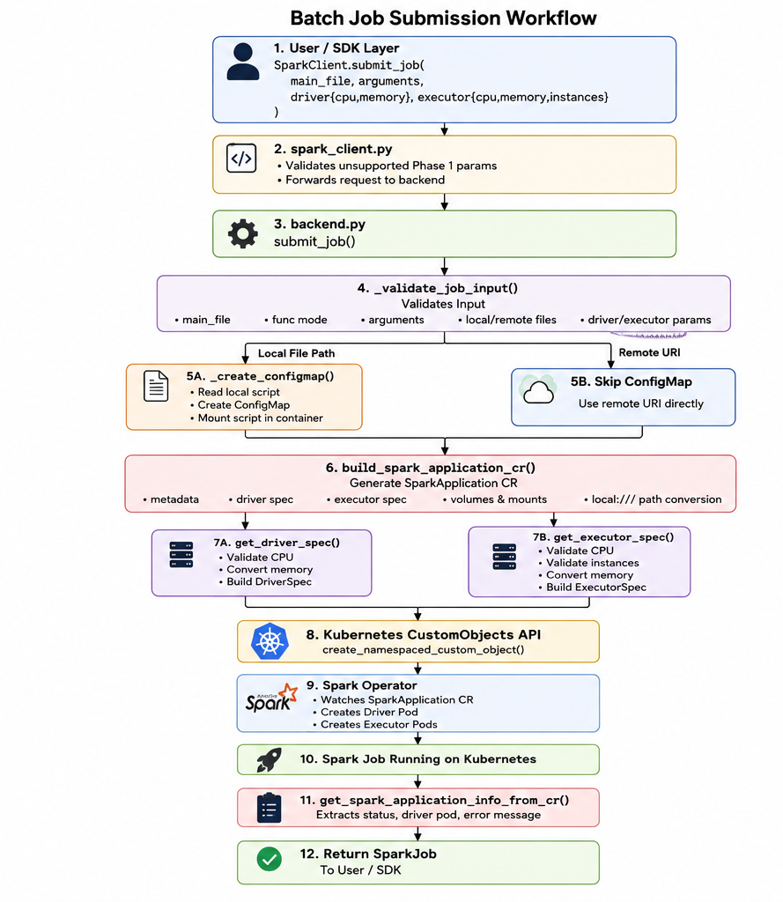
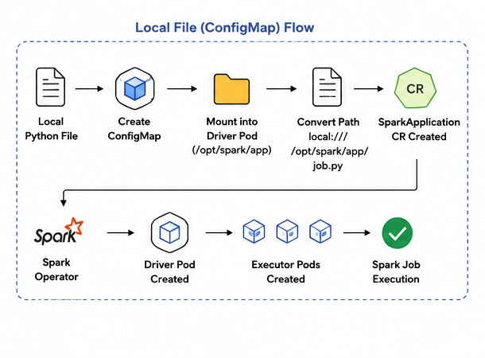
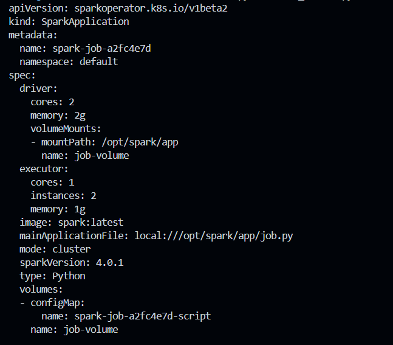
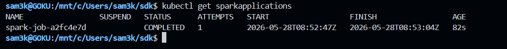
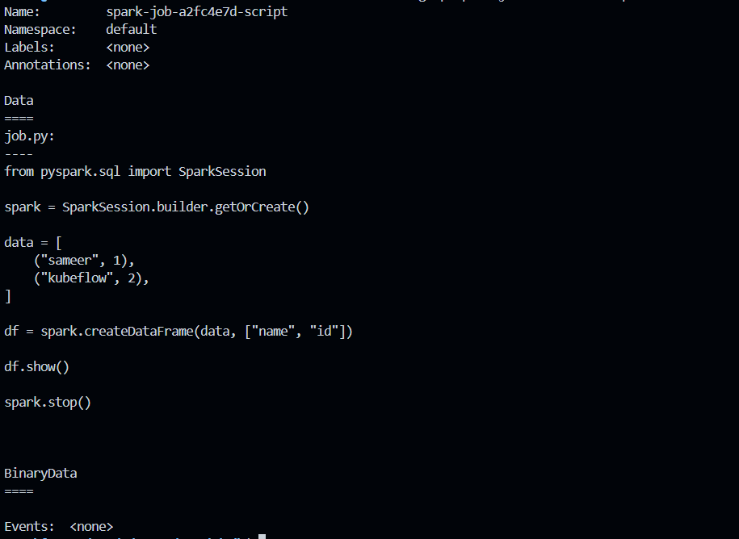
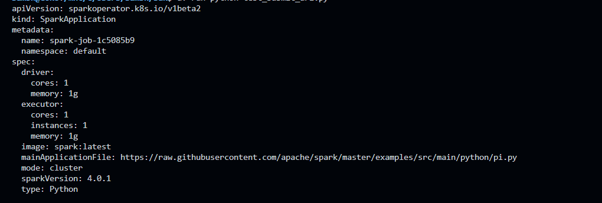

# Batch Job Submission

## Overview

This document describes the implementation of Phase 1 Batch Job Submission for the Kubeflow Spark SDK using the Spark Operator on Kubernetes.

The implementation currently supports:

- Python file-based batch job submission
- Local file submission using ConfigMap mounting
- Remote URI-based submission
- SparkApplication CR generation
- Driver and executor resource configuration
- Validation and safety checks
- Kubernetes async submission flow

The implementation was validated using Kind environment.

---

# Supported Submission Modes

## Local File Submission

Users can submit local Python files directly from the SDK.

Example:

```python
client.submit_job(
    main_file="./job.py",
)
```

Workflow:

1. Validate local file
2. Create ConfigMap
3. Mount ConfigMap into Spark driver pod
4. Convert file path into `local:///`
5. Generate SparkApplication CR
6. Submit to Spark Operator

---

## Remote URI Submission

Users can submit remote Python files directly using supported URI schemes.

Supported examples:

- `s3://`
- `s3a://`
- `gs://`
- `http://`
- `https://`
- `hdfs://`

Example:

```python
client.submit_job(
    main_file="https://raw.githubusercontent.com/apache/spark/master/examples/src/main/python/pi.py",
)
```

Workflow:

1. Validate remote URI
2. Skip ConfigMap creation
3. Directly generate SparkApplication CR
4. Submit to Spark Operator

---

# Architecture Workflow

## Batch Job Submission Workflow

```text
SparkClient
    ↓
spark_client.py
    ↓
backend.submit_job()
    ↓
Input Validation
    ↓
ConfigMap Flow OR Remote URI Flow
    ↓
SparkApplication CR Generation
    ↓
Kubernetes CustomObjects API
    ↓
Spark Operator
    ↓
Driver / Executor Pods
    ↓
Spark Job Execution
```



---

# ConfigMap Flow

## Local File (ConfigMap) Flow

ConfigMap flow is used because Kubernetes pods cannot directly access files from the user's local machine.

Local Python files are:

1. Read locally
2. Stored inside a Kubernetes ConfigMap
3. Mounted into the Spark driver container
4. Executed using a `local:///` Spark path

Example mounted path:

```text
local:///opt/spark/app/job.py
```



---

# SparkApplication CR Generation

Example generated SparkApplication:

```yaml
apiVersion: sparkoperator.k8s.io/v1beta2
kind: SparkApplication

metadata:
  name: spark-job-a2fc4e7d
  namespace: default

spec:
  driver:
    cores: 2
    memory: 2g
    volumeMounts:
      - mountPath: /opt/spark/app
        name: job-volume

  executor:
    cores: 1
    instances: 2
    memory: 1g

  image: spark:latest

  mainApplicationFile: local:///opt/spark/app/job.py

  mode: cluster
  sparkVersion: 4.0.1
  type: Python

  volumes:
    - configMap:
        name: spark-job-a2fc4e7d-script
      name: job-volume
```

The CR is generated dynamically using typed API models.

## Results

### Generated SparkApplication YAML



### SparkApplication Created



---

# Driver and Executor Configuration

Users can configure Spark driver and executor resources.

Example:

```python
client.submit_job(
    main_file="./job.py",
    driver={
        "cpu": "2",
        "memory": "4Gi",
    },
    executor={
        "cpu": "1",
        "memory": "2Gi",
        "instances": 2,
    },
)
```

Generated SparkApplication snippet:

```yaml
driver:
  cores: 2
  memory: 4g

executor:
  cores: 1
  memory: 2g
  instances: 2
```

## Results

### Driver Pod Running


---

# Validation Flow

Current validation includes:

- local file existence validation
- remote URI validation
- argument type validation
- CPU validation
- executor instance validation
- ConfigMap size validation
- timeout handling
- runtime exception handling

Example validations:

```text
Invalid CPU value
Executor instances <= 0
Missing local file
Invalid remote URI
ConfigMap size > 1MB
```

---

# Kubernetes Runtime Flow

For local file submission:

```text
Local Python File
        ↓
Create ConfigMap
        ↓
Mount into Driver Pod
        ↓
Convert path to local:///
        ↓
Generate SparkApplication
        ↓
Spark Operator creates Driver Pod
        ↓
Spark Operator creates Executor Pods
        ↓
Spark Job Execution
```

For remote URI submission:

```text
Remote URI
      ↓
Skip ConfigMap
      ↓
Generate SparkApplication
      ↓
Submit to Spark Operator
      ↓
Driver / Executor Creation
      ↓
Spark Job Execution
```

---

# Kind Testing

The implementation was validated using Kind environment.

Validated flows:

- SparkApplication submission
- Local file submission
- Remote URI submission
- ConfigMap creation
- ConfigMap mounting
- Driver pod creation
- Executor pod creation
- Generated SparkApplication YAML
- Kubernetes async submission flow

---

# Local File Submission Validation

## ConfigMap Created

The local Python file is stored inside a Kubernetes ConfigMap before mounting into the Spark driver container.



---

# Remote URI Submission Validation

## Remote URI Generated YAML

Generated SparkApplication YAML for remote URI submission:



---

## Remote URI Submission

SparkApplication successfully submitted using remote URI flow:


---

## Remote URI Driver Running

Spark Operator successfully created the driver pod for remote URI execution:


---

# Current Status

## Implemented

- File-based batch job submission
- Local file submission
- Remote URI submission
- ConfigMap flow
- SparkApplication CR generation
- Driver/executor configurability
- Kubernetes submission flow
- Validation and safety checks

## Pending

- Function mode (`func=`)
- Lifecycle APIs
  - `get_job()`
  - `list_jobs()`
  - `delete_job()`
  - `wait_for_job_status()`
  - `get_job_logs()`
- Advanced Spark configuration support
- Unit test completion
